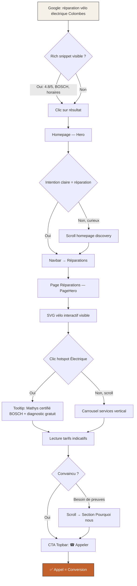
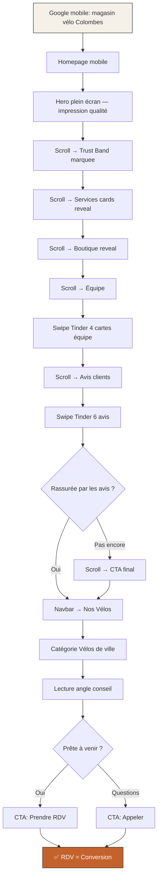
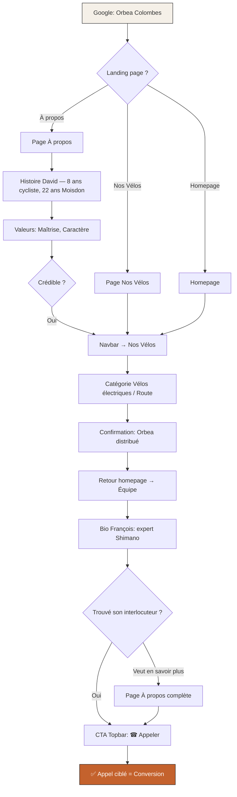
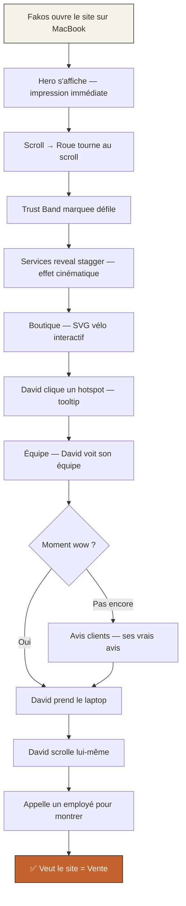

---
stepsCompleted:
  - step-01-init
  - step-02-discovery
  - step-03-core-experience
  - step-04-emotional-response
  - step-05-inspiration
  - step-06-design-system
  - step-07-defining-experience
  - step-08-visual-foundation
  - step-09-design-directions
  - step-10-user-journeys
  - step-11-component-strategy
  - step-12-ux-patterns
  - step-13-responsive-accessibility
  - step-14-complete
inputDocuments:
  - _bmad-output/planning-artifacts/prd.md
  - _bmad-output/planning-artifacts/product-brief-Colombes-cycles-2026-03-03.md
  - audit.md
  - brand-strategy.md
  - copy.md
  - seo-strategy.md
  - docs/index.md
  - docs/project-overview.md
  - docs/architecture.md
  - docs/component-inventory.md
  - docs/development-guide.md
  - docs/source-tree-analysis.md
---

# UX Design Specification Colombes-cycles

**Author:** Fakos
**Date:** 2026-03-03

---

<!-- UX design content will be appended sequentially through collaborative workflow steps -->

## Executive Summary

### Project Vision

Colombes Cycles est un commerce de cycles indépendant à Colombes (92700) avec une réputation en magasin excellente (4.8/5, 271 avis Google) mais une présence web qui la dessert. Le site actuel WordPress (OceanWP) est générique, non responsive, sans identité. Le projet est une refonte vers un site Next.js premium, animation-first, mobile-first — d'abord outil de vente (démo pour le propriétaire), puis vitrine publique, puis plateforme admin et outil métier.

L'UX doit résoudre un paradoxe : un design premium (anthracite, Syne, animations sophistiquées) qui reste chaleureux et accessible. Le sentiment cible est : "Je suis entre de bonnes mains. Ce sont de vrais passionnés."

### Target Users

**4 personas, 1 tunnel de conversion commun :**

| Persona | Besoin principal | Device | Déclencheur |
|---|---|---|---|
| Marc (VAE, 44 ans) | Réparation urgente + confiance | iPhone | Recherche Google "réparation vélo électrique Colombes" |
| Sophie (quotidien, 37 ans) | Tarifs honnêtes + pas de sur-vente | Android | Recherche Google "révision vélo Colombes pas cher" |
| Thierry (expert, 58 ans) | Expertise reconnue + marques | Desktop | Recherche Google "Orbea Colombes" |
| Camille (primo, 28 ans) | Conseil sans condescendance | Android | Recherche Google "magasin vélo Colombes" |

**Parcours commun :** Google → rich snippet → clic → hero (3s pour convaincre) → scroll/exploration → CTA (appeler ou prendre RDV)

**Audience additionnelle critique :** David Thibault (propriétaire) qui voit le site en présentation et doit vouloir l'acheter — le "wow" est le KPI émotionnel n°1.

### Key Design Challenges

1. **Première impression en 3 secondes** — Le hero doit communiquer instantanément : expertise (pas un template), chaleur humaine (pas une agence corporate), et preuve sociale (note, certification, expérience)
2. **Interactions tactiles mobile fiables** — Swipe Tinder sur cartes avis/équipe : seuil touch précis, direction claire, feedback visuel immédiat, pas de conflit avec le scroll natif
3. **SVG interactif accessible** — Le vélo SVG avec hotspots doit fonctionner au clavier, avoir des fallbacks, et ne pas intimider les utilisateurs non-techniques
4. **Performance = crédibilité** — Lighthouse > 95 n'est pas une métrique technique, c'est une preuve de craft. Un site lent pendant la démo à David = échec commercial
5. **Équilibre premium/chaleureux** — Le design system (anthracite, animations, Syne) doit amplifier la voix du copy ("on vous dit ce qu'on pense vraiment") et non l'écraser

### Design Opportunities

1. **Scroll narratif** — Les 8 sections homepage composent une histoire émotionnelle (captation → preuve → démonstration → humanisation → validation → conversion) rythmée par les animations reveal
2. **Micro-interaction signature** — La roue vélo (BikeWheel) qui tourne au scroll ancre le thème dans la mécanique du site et rend l'expérience mémorable
3. **Engagement tactile mobile** — Le swipe Tinder sur avis/équipe crée un engagement physique absent des sites concurrents — le visiteur interagit avec le contenu plutôt que de le subir
4. **Différenciation instantanée** — Aucun vélociste indépendant en France n'a ce niveau de craft web. Le gap visuel entre ce site et les templates WordPress concurrents est le premier argument de vente

## Core User Experience

### Defining Experience

**L'action core :** Le visiteur arrive depuis Google, scanne le hero en 3 secondes, **se sent en confiance**, et scrolle ou navigue jusqu'à trouver la réponse à son besoin — puis **appelle** (01 42 42 66 02) ou **vient en boutique**.

Ce n'est pas une app avec un core loop récurrent. C'est un site vitrine avec un **tunnel de conversion unique et court** :

```
Google → Hero (3s) → Scroll narratif OU navigation directe → CTA conversion
```

L'action critique n'est pas un clic. C'est un **sentiment** : "Ces gens savent ce qu'ils font, et ils sont honnêtes." Si ce sentiment existe en moins de 10 secondes, tout le reste suit.

**L'action secondaire critique :** David Thibault voit le site en présentation, prend le laptop, et commence à scroller lui-même. Le moment "wow" est **physique** — il s'empare de l'objet.

### Platform Strategy

| Aspect | Décision |
|---|---|
| **Plateforme** | Web responsive — pas d'app native |
| **Device prioritaire** | Mobile (iPhone Safari + Android Chrome) — le trafic local est majoritairement mobile |
| **Input principal** | Touch (mobile) + mouse/keyboard (desktop) |
| **Breakpoints** | < 640px mobile, 640-1024px tablette, > 1024px desktop |
| **Offline** | Non requis (MVP). PWA scopée admin uniquement (V2+) |
| **Capacités device exploitées** | Touch swipe (cartes Tinder), `tel:` link (appel direct), géolocalisation (Google Maps), `prefers-reduced-motion` |

**Adaptation par device :**

| Feature | Mobile | Desktop |
|---|---|---|
| Navigation | Hamburger animé | Navbar sticky + dropdown |
| Avis clients | Swipe Tinder (stack) | Grille 2×3 |
| Équipe | Swipe Tinder (stack) | Grille 2×2 |
| SVG vélo interactif | Carrousel horizontal services | SVG cliquable avec hotspots |
| Parallax | Désactivé ou réduit | Multi-vitesse complet |
| Hero | Plein écran, fade-out scroll | Parallax multi-couche |

### Effortless Interactions

**Ce qui doit être invisible (zéro friction) :**

1. **Trouver le numéro de téléphone** — Topbar sticky, toujours visible, un tap = appel. Pas besoin de chercher, pas besoin de copier-coller.

2. **Comprendre ce qu'ils font** — Le scroll depuis le hero raconte l'histoire sans aucun clic nécessaire. Les animations reveal guident l'oeil section par section. Le visiteur comprend "vente + réparation + conseil par des experts locaux honnêtes" sans lire un seul paragraphe en entier.

3. **Naviguer les services de réparation** — Sur desktop, le SVG vélo montre visuellement les 6 zones d'intervention. Sur mobile, le carrousel horizontal est swipeable naturellement. Pas de page à charger, pas de menu à ouvrir.

4. **Voir les avis/équipe sur mobile** — Le swipe Tinder est le geste le plus naturel sur mobile. Pas de pagination, pas de "voir plus", pas de scroll horizontal ambigu.

5. **Revenir au site depuis Google** — Les redirections 301 depuis les anciennes URLs WordPress interceptent les liens morts. La page 404 custom ramène au bon endroit.

**Où les concurrents échouent (et nous pas) :**
- Les sites WordPress vélocistes ont des sliders lents, des menus 404, des images non optimisées
- Les grandes surfaces (Décathlon) ont des sites génériques et impersonnels
- Les pure players n'ont aucune dimension humaine ou locale

### Critical Success Moments

| Moment | Ce qui se passe | Ce qui échoue si raté |
|---|---|---|
| **Hero load (0-3s)** | Le visiteur voit "Ici, on connaît votre vélo" + bande de confiance marquee. Il perçoit que ce n'est pas un template. | Il quitte — taux de rebond > 70% |
| **Premier scroll (3-15s)** | Les sections reveal apparaissent avec un rythme qui crée du mouvement et de la curiosité. Il continue à scroller. | Il s'arrête, le scroll est trop lent ou les animations janky |
| **Premier swipe avis (mobile)** | Il lit un vrai avis, swipe naturellement, en lit un second. Les mots des clients font le travail de conviction. | Le swipe ne fonctionne pas ou interfère avec le scroll → frustration |
| **CTA conversion** | Il tape "Appeler" ou "Prendre RDV" — l'action est immédiate, le lien `tel:` ouvre le dialer | Le CTA est caché ou le numéro n'est pas cliquable |
| **Présentation David** | David prend le laptop et scrolle lui-même. "Regarde ce qu'ils ont fait." | Les animations sont saccadées ou le contenu ne le décrit pas fidèlement |

### Experience Principles

1. **Confiance avant conversion** — Chaque élément visible dans les 10 premières secondes doit construire la confiance (preuve sociale, certification, expérience). La conversion est une conséquence, pas un objectif affiché.

2. **Le scroll raconte l'histoire** — La homepage n'est pas une page de sections — c'est un récit visuel. Les animations reveal créent un rythme narratif : captation → preuve → démonstration → humanisation → validation → action. Le visiteur ne "lit" pas — il "vit" le scroll.

3. **Touch = engagement** — Sur mobile, les interactions tactiles (swipe avis, swipe équipe) transforment le visiteur passif en participant actif. Chaque geste physique crée une micro-connexion émotionnelle avec le contenu.

4. **L'invisible est roi** — Les meilleures interactions sont celles qu'on ne remarque pas : le numéro de téléphone toujours accessible, les redirections 301 qui rattrapent les liens morts, les animations qui s'effacent avec `prefers-reduced-motion`. Le craft se mesure à ce qui fonctionne sans qu'on y pense.

5. **Premium ≠ froid** — Le design system (anthracite, Syne, animations sophistiquées) sert la chaleur du copy, pas l'inverse. Si une animation impressionne mais éloigne émotionnellement, elle est supprimée. Le sentiment cible reste : "Je suis entre de bonnes mains."

## Desired Emotional Response

### Primary Emotional Goals

**Sentiment cible global :** *"Je suis entre de bonnes mains. Ce sont de vrais passionnés."*

Ce sentiment se décompose en 3 émotions primaires :

| Émotion | Déclencheur UX | Résultat attendu |
|---|---|---|
| **Confiance immédiate** | Hero + bande de confiance (4.8/5, BOSCH, 15 ans, 1ère révision offerte) | Le visiteur n'a pas besoin de "vérifier" — il *sent* que c'est sérieux |
| **Chaleur humaine** | Bios équipe, ton du copy ("on vous dit ce qu'on pense vraiment"), avis clients avec des mots vrais | Le visiteur perçoit des personnes réelles, pas une enseigne |
| **Admiration du craft** | Animations fluides, design cohérent, micro-interactions (roue vélo, parallax, swipe Tinder) | Le visiteur (et David) se dit "c'est beau, c'est travaillé" — le "wow" |

### Emotional Journey Mapping

| Phase | Durée | Émotion visée | Anti-émotion à éviter |
|---|---|---|---|
| **Découverte (Google → hero)** | 0-3s | Surprise positive ("ce n'est pas un template") | Indifférence ("encore un site de vélo") |
| **Exploration (scroll homepage)** | 3-45s | Curiosité engagée (chaque section révèle quelque chose de nouveau) | Lassitude (sections répétitives, scroll interminable) |
| **Connexion (avis + équipe)** | 30-90s | Appartenance ("ces gens sont comme moi / comprennent mes besoins") | Méfiance ("c'est trop marketing, c'est pas authentique") |
| **Information (réparations, tarifs, vélos)** | Variable | Clarté rassurante ("je sais à quoi m'attendre") | Confusion ("je ne trouve pas ce que je cherche") |
| **Conversion (CTA appeler/RDV)** | Instant | Détermination naturelle ("je les appelle, c'est évident") | Hésitation ("je vais comparer d'autres sites") |
| **Erreur (404, lien mort)** | Instant | Bienveillance ("ils ont prévu ça, pas grave") | Frustration ("site cassé, pas pro") |

### Micro-Emotions

**Les micro-émotions qui font la différence :**

| Micro-émotion | Interaction qui la déclenche | Pourquoi ça compte |
|---|---|---|
| **Plaisir kinesthésique** | Swipe Tinder sur les cartes avis/équipe (feedback tactile, rotation, direction) | Engagement physique = mémorisation + connexion émotionnelle |
| **Satisfaction de découverte** | SVG vélo interactif — cliquer un hotspot et voir le service apparaître | "J'ai trouvé ce que je cherchais en jouant, pas en cherchant" |
| **Émerveillement discret** | Roue vélo qui tourne au scroll, parallax multi-vitesse, reveal fluides | Pas du "wow" tape-à-l'oeil — du craft qu'on remarque sans s'en rendre compte |
| **Soulagement** | Tarifs affichés clairement, "on ne remplace pas ce qui n'est pas usé" | La peur d'être arnaqué disparaît |
| **Fierté locale** | "Votre atelier de cycles à Colombes depuis 15 ans", ancrage quartier | "C'est mon commerce de quartier, et il a un site comme ça" |

### Design Implications

| Émotion visée | Choix UX qui la supporte |
|---|---|
| **Confiance** | Topbar sticky avec téléphone toujours visible. Bande de confiance en premier contenu après le hero. Avis clients réels (pas de texte marketing). Tarifs indicatifs visibles sans clic supplémentaire. |
| **Chaleur** | Typo Syne humanisée (pas géométrique/froide). Copy en "on/nous" (pas "Colombes Cycles s'engage"). Photos équipe avec bios personnalisées. Fond ivoire #F5F0E8 (pas blanc froid). |
| **Craft** | Animations reveal synchronisées (pas aléatoires). Parallax avec timing calculé. Transitions sans jank (rAF-throttled). Cohérence design system sur chaque page. |
| **Clarté** | Grille tarifaire sans astérisques ambigus. Navigation en 1 clic max vers le contenu. Breadcrumbs sur toutes les pages intérieures. Titres de section qui disent exactement le contenu. |
| **Accessibilité émotionnelle** | `prefers-reduced-motion` = toutes animations désactivées. Contraste > 7:1. Ton non-intimidant dans le copy. Le SVG vélo a un fallback carrousel compréhensible. |

### Emotional Design Principles

1. **La confiance se construit dans les 3 premières secondes** — Pas de hero artistique sans contenu. Les preuves sociales (4.8/5, BOSCH, 15 ans) sont le premier contenu lu. Le design sert la preuve, pas l'inverse.

2. **L'authenticité bat la perfection** — Les avis clients avec des fautes d'orthographe sont plus convaincants qu'un texte marketing parfait. Les bios d'équipe avec des détails vrais ("celui à qui vous parlez de Shimano sans qu'il lève les yeux au ciel") créent plus de connexion que des portraits corporate.

3. **Le plaisir vient de l'inattendu maîtrisé** — Le swipe Tinder sur un site de vélociste est inattendu. La roue qui tourne au scroll est inattendue. Le SVG vélo cliquable est inattendu. Mais chaque interaction est immédiatement compréhensible — pas de courbe d'apprentissage.

4. **L'émotion négative est un signal d'alarme UX** — Si un visiteur ressent de la confusion (navigation), de la méfiance (contenu trop marketing), de la frustration (animation lente), ou de l'intimidation (jargon technique non expliqué), c'est un bug UX à corriger, pas une opinion subjective.

5. **Le silence émotionnel est un échec** — Si le visiteur quitte le site sans avoir ressenti quoi que ce soit — ni confiance, ni curiosité, ni admiration — le design a échoué, même si Lighthouse affiche 100.

## UX Pattern Analysis & Inspiration

### Inspiring Products Analysis

**1. Tinder — Le swipe comme engagement**

| Aspect | Ce qu'ils font bien | Pertinence Colombes Cycles |
|---|---|---|
| **Interaction core** | Un geste = une décision. Le swipe est le raccourci cognitif le plus rapide. | Les cartes avis/équipe utilisent ce même pattern — chaque swipe est une micro-découverte |
| **Feedback physique** | Rotation de la carte dans la direction du swipe, opacité variable, snap retour | Déjà implémenté dans `MobileCardStack` / `MobileReviewStack` avec seuil 50px |
| **Engagement addictif** | Le "un de plus" — l'utilisateur swipe au-delà de ce qu'il prévoyait | Sur Colombes Cycles : les 4 membres d'équipe et 6 avis sont assez courts pour créer cet effet |

**2. Apple.com — Le scroll narratif premium**

| Aspect | Ce qu'ils font bien | Pertinence Colombes Cycles |
|---|---|---|
| **Scroll = cinéma** | Chaque viewport raconte un chapitre. Les animations sont synchronisées au scroll, pas au temps. | La homepage Colombes Cycles a 8 sections = 8 chapitres. Le reveal IntersectionObserver crée ce rythme. |
| **Typographie comme hiérarchie émotionnelle** | Titres massifs → sous-titres → corps. Le contraste de taille guide l'oeil avant la lecture. | Syne en bold pour les titres de section, Inter en regular pour le corps. Le gap typographique porte l'émotion. |
| **Espace blanc intentionnel** | Le vide n'est pas du gaspillage — c'est du rythme respiratoire entre les sections. | Le fond crème #FAFAF7 et les sections alternées anthracite/ivoire créent ce rythme. |

**3. Notion — L'invisible fait bien**

| Aspect | Ce qu'ils font bien | Pertinence Colombes Cycles |
|---|---|---|
| **Performance perçue** | L'interface répond instantanément. Pas d'animation gratuite — chaque transition a un but. | Lighthouse > 95 + SSG = le site charge instantanément. Les animations rAF-throttled ne bloquent jamais. |
| **Navigation prévisible** | On sait toujours où on est, comment revenir, et où aller ensuite. | Breadcrumbs, topbar sticky, navbar avec état actif, footer avec liens complets. |

**4. Sites artisanaux premium (Aesop, Le Labo, Blue Bottle Coffee)**

| Aspect | Ce qu'ils font bien | Pertinence Colombes Cycles |
|---|---|---|
| **Design premium ≠ froid** | Palette sourde (terre, beige, anthracite), typo serif, espace généreux — mais contenu chaleureux et humain | Exactement la DA de Colombes Cycles : anthracite/ivoire/terracotta + copy chaleureux |
| **Craft visible** | Les détails design (micro-animations, transitions, typographie soignée) signalent le soin sans être tape-à-l'oeil | La roue vélo, les parallax, les reveal — chaque détail dit "quelqu'un a pris le temps" |
| **Storytelling produit** | L'histoire du fondateur, les valeurs, le processus — le produit est secondaire par rapport à la philosophie | L'histoire de David, les valeurs Franchise/Maîtrise/Ancrage/Soin/Caractère, le "pourquoi" avant le "quoi" |

### Transferable UX Patterns

**Navigation Patterns :**

| Pattern | Source | Application Colombes Cycles |
|---|---|---|
| **Sticky navigation avec transparence → opaque au scroll** | Apple, Airbnb | Navbar qui devient opaque après le hero — déjà implémenté |
| **Mega menu catégories avec preview** | E-commerce premium | Dropdown "Nos Vélos" avec 5 catégories — simple et direct |
| **Topbar utilitaire permanente** | Sites commerce B&M | Téléphone + horaires toujours visibles — critique pour la conversion |

**Interaction Patterns :**

| Pattern | Source | Application Colombes Cycles |
|---|---|---|
| **Swipe-to-dismiss (Tinder)** | Tinder, dating apps | Cartes avis + cartes équipe sur mobile |
| **Scroll-triggered reveal** | Apple, agences créatives | 8 sections homepage avec fade-in/slide IntersectionObserver |
| **Hotspot interactif sur illustration** | Apps éducatives, configurateurs | SVG vélo avec 6 zones cliquables + cercles pulsants |
| **Parallax multi-vitesse** | Sites portfolio, agences | Texte MÉTIER et éléments décoratifs avec `data-speed` |
| **Marquee infini** | Sites mode, tech startups | Bande de confiance avec 4 badges en boucle |

**Visual Patterns :**

| Pattern | Source | Application Colombes Cycles |
|---|---|---|
| **Palette terre/sombre** | Aesop, Le Labo | Anthracite #1C1C1E + Ivoire #F5F0E8 + Terracotta #C4622D |
| **Sans-serif display pour les titres** | Editorial design, magazines | Syne 400-800 (géométrique humaniste, pas froide) |
| **Sections alternées clair/sombre** | Sites premium multi-sections | Homepage alterne fond crème et fond anthracite |
| **Cards avec ombre portée subtile** | Material Design adapté | Cartes équipe et avis avec élévation légère |

### Anti-Patterns to Avoid

| Anti-pattern | Pourquoi c'est nocif | Risque pour Colombes Cycles |
|---|---|---|
| **Slider/carousel auto-play** | Les utilisateurs ne voient que la première slide. Le mouvement non contrôlé distrait. | Le site WordPress actuel a exactement ce problème. Les reveal scroll-triggered sont la bonne alternative. |
| **Hamburger menu sur desktop** | Cache la navigation sans raison. Les utilisateurs desktop veulent voir les liens. | La navbar desktop affiche les 5 liens + dropdown. Hamburger réservé au mobile uniquement. |
| **CTA "N'hésitez pas à nous contacter"** | Passif, générique, sans personnalité. | Le copy utilise "Prendre RDV", "Appeler" — verbes d'action directs. |
| **Pop-up newsletter au premier visit** | Interrompt le parcours avant que la confiance soit établie. | Aucun pop-up prévu. La conversion passe par le CTA naturel en fin de scroll. |
| **Animations qui bloquent la navigation** | L'utilisateur attend que l'animation finisse pour pouvoir agir. | Toutes les animations Colombes Cycles sont non-bloquantes (reveal = apparition, pas transition obligatoire). |
| **Images placeholder/stock** | Détruit la crédibilité instantanément. Les utilisateurs détectent les photos génériques. | MVP avec SVG illustrations > stock photos. Photos réelles = pré-lancement. |
| **Carte Google Maps qui capture le scroll** | Frustration majeure — le visiteur scroll la page et zoome la carte involontairement. | Google Maps en iframe lazy-loaded sur la page Contact, pas sur la homepage. |

### Design Inspiration Strategy

**Ce qu'on adopte :**
- Le swipe Tinder comme pattern d'engagement mobile (déjà implémenté)
- Le scroll narratif Apple-like avec reveal séquentiel (déjà implémenté)
- La palette artisanale premium type Aesop/Le Labo (déjà en place)
- La topbar utilitaire commerce physique (déjà en place)

**Ce qu'on adapte :**
- Le parallax Apple — réduit sur mobile (performance), multi-vitesse sur desktop uniquement
- Le hotspot interactif — SVG vélo au lieu d'un produit tech, avec fallback carrousel mobile
- Le marquee mode/tech — adapté en bande de confiance avec preuves sociales au lieu de logos partenaires

**Ce qu'on évite :**
- Le slider WordPress (remplacé par le hero statique + parallax)
- Le pop-up newsletter (remplacé par le CTA naturel en fin de scroll)
- Les animations bloquantes (toutes non-bloquantes via IntersectionObserver)
- Les photos stock (SVG illustrations MVP, photos réelles au lancement)

## Design System Foundation

### Design System Choice

**Approche retenue : Custom Design System** — Système de design entièrement sur mesure, construit sur Tailwind CSS et CSS custom properties, sans aucune dépendance à une bibliothèque UI tierce.

Ce choix s'impose naturellement pour un site vitrine dont l'identité visuelle artisanale et premium constitue le principal levier de conversion. Les 31 composants existants forment déjà la base d'un design system cohérent.

### Rationale for Selection

| Critère | Évaluation |
|---|---|
| **Unicité visuelle** | Maximale — contrôle pixel-perfect sur chaque composant |
| **Cohérence avec l'existant** | 31 composants + design tokens déjà implémentés |
| **Système d'animation** | 6 couches custom incompatibles avec les UI libraries standard |
| **Performance** | Zéro JS de bibliothèque UI = bundle minimal, Lighthouse > 95 |
| **Maintenance** | Scope limité (site vitrine ~7 pages) = complexité maîtrisable |
| **Philosophie** | Zéro dépendance animation = zéro dépendance UI |

### Implementation Approach

**Design Tokens (CSS Custom Properties)**

```css
/* Palette */
--color-anthracite: #1C1C1E;
--color-ivory: #F5F0E8;
--color-terracotta: #C4622D;
--color-cream: #FAFAF7;

/* Typographie */
--font-display: 'Syne', sans-serif;      /* Titres — humaniste géométrique */
--font-body: 'Inter', sans-serif;        /* Corps — lisibilité */

/* Spacing (échelle 4px) */
--space-xs: 0.25rem;   /* 4px */
--space-sm: 0.5rem;    /* 8px */
--space-md: 1rem;      /* 16px */
--space-lg: 2rem;      /* 32px */
--space-xl: 4rem;      /* 64px */
--space-2xl: 8rem;     /* 128px */

/* Breakpoints */
--bp-mobile: 640px;
--bp-tablet: 768px;
--bp-desktop: 1024px;
--bp-wide: 1280px;
```

**Architecture des composants**

| Couche | Responsabilité | Exemples |
|---|---|---|
| **Primitives** | Éléments atomiques réutilisables | Button, Badge, Card, Icon |
| **Composants** | Blocs fonctionnels composés | BikeCard, ServiceCard, TeamMember, ReviewCard |
| **Sections** | Assemblages pleine largeur | Hero, TrustBand, ServicesGrid, TeamSection |
| **Layouts** | Structure de page | Header, Footer, PageWrapper, RouteGroup |
| **Animations** | Couches d'animation transversales | ScrollReveal, ParallaxLayer, TinderSwipe, WheelSVG |

**Conventions Tailwind**

- Classes utilitaires Tailwind pour layout, spacing, responsive
- CSS custom properties pour les valeurs sémantiques (couleurs, typo)
- `@apply` limité aux patterns répétitifs (boutons, liens)
- Pas de `styled-components` ni CSS-in-JS

### Customization Strategy

**Stratégie d'extension :**

1. **Tokens first** — Toute nouvelle valeur visuelle passe par un token CSS custom property avant d'être utilisée dans un composant
2. **Composant > utilitaire** — Si un pattern Tailwind dépasse 5 classes, il devient un composant React
3. **Variants par props** — Les variantes (taille, couleur, état) sont gérées par props React + `clsx`, pas par des classes conditionnelles inline
4. **Responsive par breakpoint Tailwind** — Mobile-first, `sm:` / `md:` / `lg:` / `xl:` pour les adaptations
5. **Animation isolée** — Chaque couche d'animation est un hook ou wrapper indépendant, composable avec n'importe quel composant

## 2. Core User Experience

### 2.1 Defining Experience

**"Scroller, c'est découvrir l'atelier."**

L'expérience qui définit Colombes Cycles tient en une phrase : **le scroll transforme une page web en visite de boutique**. Chaque section qui apparaît est une porte qu'on pousse — on entre dans l'univers, on découvre les visages, on touche (swipe) les avis, on tourne la roue.

**L'équivalent célèbre :**
- Tinder : "Swipe pour matcher"
- Apple : "Scroll pour découvrir le produit"
- **Colombes Cycles : "Scroll pour visiter l'atelier"**

Si on réussit ce parcours scroll — le visiteur qui arrive curieux et repart convaincu que David et son équipe sont les bons artisans pour son vélo — tout le reste (SEO, pages secondaires, blog) est un bonus. Le site est une **démo de savoir-faire**, pas un catalogue.

### 2.2 User Mental Model

**Comment les visiteurs arrivent :**

| Source | Mental model entrant | Attente |
|---|---|---|
| **Google "réparation vélo Colombes"** | "Je cherche un vélociste proche et fiable" | Voir le téléphone, les horaires, les tarifs — vite |
| **Google Maps / Avis** | "J'ai lu les avis, je veux confirmer" | Voir le site pro, l'équipe, les services détaillés |
| **Bouche-à-oreille** | "On m'a dit d'aller chez David" | Voir que c'est bien le bon endroit, trouver l'adresse |
| **Passant curieux** | "J'ai vu la boutique, je regarde le site" | Retrouver l'ambiance qu'il a ressentie devant la vitrine |

**Ce que les visiteurs connaissent déjà :**
- Scroller une page = acquis universel (aucune courbe d'apprentissage)
- Cliquer un numéro de téléphone sur mobile = réflexe
- Swiper des cartes = pattern Tinder intégré culturellement depuis 2012

**Ce qu'ils ne connaissent PAS :**
- Un site de vélociste avec des animations premium → l'effet "waouh" vient de ce décalage entre l'attendu (site WordPress basique) et le réel (expérience Apple-like)

### 2.3 Success Criteria

**L'expérience core est réussie quand :**

| Indicateur | Mesure | Seuil |
|---|---|---|
| **Scroll profond** | Le visiteur atteint la section Avis (section 7/8) | > 60% des sessions |
| **Temps sur page** | Le visiteur reste assez pour absorber le storytelling | > 90 secondes homepage |
| **Interaction tactile** | Le visiteur swipe au moins 2 cartes (équipe ou avis) | > 40% des sessions mobile |
| **Conversion micro** | Le visiteur clique sur le téléphone ou le CTA contact | > 8% des sessions |
| **Effet "waouh"** | Le visiteur dit "c'est pas un site de vélo normal" | Qualitatif — feedback David/clients |
| **Zéro friction** | Aucun visiteur ne cherche plus de 3 secondes le téléphone | Topbar visible en permanence |

**Le visiteur dit "ça marche" quand :**
- Il a compris en 5 secondes que c'est un vélociste artisanal premium
- Il a ressenti la passion de l'équipe sans lire un pavé de texte
- Il a trouvé le téléphone/l'adresse sans effort
- Il a une raison de préférer Colombes Cycles à Decathlon (confiance, proximité, expertise)

### 2.4 Novel UX Patterns

**Analyse : Combinaison innovante de patterns établis**

Colombes Cycles n'invente aucun pattern — il combine des patterns de domaines différents dans un contexte inattendu :

| Pattern | Origine | Innovation ici |
|---|---|---|
| **Scroll narratif** | Apple, sites produit tech | Appliqué à un commerce local — décalage de registre qui surprend |
| **Swipe Tinder** | Dating apps | Appliqué à des avis clients et des profils d'équipe — micro-engagement ludique |
| **SVG interactif** | Configurateurs auto, apps éducatives | Appliqué à un vélo avec 6 hotspots — pédagogie mécanique |
| **Parallax multi-vitesse** | Sites portfolio créatif | Appliqué à du texte typographique ("MÉTIER") — identité visuelle en mouvement |
| **Marquee infini** | Sites mode/startup | Appliqué à des badges de confiance (certification, avis) — preuve sociale continue |

**Aucune éducation nécessaire** — chaque pattern est immédiatement compréhensible car le visiteur l'a déjà vécu dans un autre contexte. Le "novel" est le cocktail, pas les ingrédients.

**Le twist unique :**
Le site de David doit donner l'impression que l'atelier a une âme digitale — pas qu'un développeur a appliqué un template. Le soin dans les micro-interactions (la roue qui tourne, le card qui suit le doigt) dit la même chose que le soin dans une réparation de dérailleur : "ici, on fait les choses bien."

### 2.5 Experience Mechanics

**Le parcours scroll homepage — mécanique détaillée :**

**1. Initiation — Hero (viewport 1)**

| Élément | Mécanique |
|---|---|
| **Déclencheur** | La page charge. Pas de loader, pas de splash. Instantané (SSG). |
| **Ce que voit l'utilisateur** | Titre Syne bold + sous-titre + CTA terracotta + texte COLOMBES en watermark |
| **Feedback** | Le CTA pulse légèrement (attention sans agressivité). Le parallax commence au premier pixel de scroll. |
| **Décision** | Scroller (curiosité) ou cliquer CTA (intention forte). Les deux sont des succès. |

**2. Interaction — Scroll Discovery (viewports 2-7)**

| Section | Déclencheur | Animation | Micro-interaction |
|---|---|---|---|
| **Trust Band** | Scroll 100vh | Marquee infini badges | Lecture passive — pas d'action requise |
| **Nos Services** | IntersectionObserver 20% | Fade-in cards décalées (stagger 100ms) | Hover card = élévation + ombre |
| **La Boutique** | IntersectionObserver 20% | SVG vélo reveal + cercles pulsants | Click hotspot = tooltip info |
| **L'Équipe** | IntersectionObserver 20% | Cards reveal | Mobile : swipe Tinder sur 4 cartes |
| **Nos Marques** | IntersectionObserver 20% | Logo grid fade-in | Hover logo = agrandissement subtil |
| **Avis Clients** | IntersectionObserver 20% | Cards reveal | Mobile : swipe Tinder sur 6 avis |

**3. Feedback continu**

| Signal | Comment |
|---|---|
| **Progression scroll** | Chaque section a un fond alternant (crème/anthracite) → le changement de couleur confirme l'avancée |
| **Récompense visuelle** | Les animations reveal récompensent le scroll — "j'ai fait apparaître ça" |
| **Confirmation tactile** | Le swipe card suit le doigt avec rotation proportionnelle → le système répond à mon geste |
| **Navigation repère** | Navbar sticky avec lien actif → je sais toujours où je suis |

**4. Completion — CTA final + Footer**

| Élément | Mécanique |
|---|---|
| **Signal de fin** | La dernière section (avis/CTA) utilise un fond différent — le visiteur sent la conclusion |
| **CTA final** | "Prendre RDV" / "Nous appeler" — verbe d'action, pas "N'hésitez pas" |
| **Footer** | Toutes les infos pratiques (adresse, horaires, tel, liens) — filet de sécurité pour ceux qui n'ont pas converti |
| **Succès** | Le visiteur a soit cliqué un CTA (conversion), soit scrollé tout le parcours (engagement maximal) |

## Visual Design Foundation

### Color System

**Palette principale**

| Token | Hex | Usage | Émotion |
|---|---|---|---|
| `--color-anthracite` | #1C1C1E | Fond premium, texte sur clair, navbar | Expertise, profondeur, sérieux |
| `--color-ivory` | #F5F0E8 | Fond sections claires, cards | Chaleur, artisanat, authenticité |
| `--color-terracotta` | #C4622D | CTA, accents, liens hover, badges | Énergie, passion, action |
| `--color-cream` | #FAFAF7 | Fond page, espace respiratoire | Calme, propreté, lisibilité |

**Couleurs sémantiques**

| Rôle | Couleur | Ratio contraste |
|---|---|---|
| **Primary** (CTA) | Terracotta #C4622D sur Crème #FAFAF7 | 5.2:1 ✅ AA |
| **Text principal** | Anthracite #1C1C1E sur Crème #FAFAF7 | 16.3:1 ✅ AAA |
| **Text inversé** | Ivoire #F5F0E8 sur Anthracite #1C1C1E | 12.1:1 ✅ AAA |
| **CTA hover** | Terracotta assombri #A8521F sur Crème | 6.8:1 ✅ AA |
| **Success** | #2D7C4A (vert mécanique) | Réservé validations formulaire |
| **Error** | #C43030 (rouge signal) | Réservé erreurs formulaire |
| **Warning** | #B8860B (ambre) | Réservé alertes non-critiques |

**Alternance sections homepage**

```
Hero        → Anthracite (impact)
Trust Band  → Crème (respiration)
Services    → Ivoire (chaleur)
Boutique    → Anthracite (immersion)
Équipe      → Crème (lumineux)
Marques     → Ivoire (neutre)
Avis        → Anthracite (conclusion)
Footer      → Anthracite (ancrage)
```

### Typography System

**Familles de polices**

| Rôle | Police | Poids | Caractère |
|---|---|---|---|
| **Display / Titres** | Syne | 600–800 | Sans-serif géométrique humaniste — impact sans froideur, personnalité forte |
| **Corps / UI** | Inter | 400–600 | Optimisée écran, excellente lisibilité petites tailles |

**Échelle typographique (mobile-first)**

| Niveau | Mobile | Desktop | Poids | Line-height | Usage |
|---|---|---|---|---|---|
| **h1** | 2.25rem (36px) | 3.5rem (56px) | Syne 800 | 1.1 | Hero titre unique |
| **h2** | 1.75rem (28px) | 2.5rem (40px) | Syne 700 | 1.2 | Titres de section |
| **h3** | 1.25rem (20px) | 1.5rem (24px) | Syne 600 | 1.3 | Sous-titres, card titles |
| **body** | 1rem (16px) | 1.125rem (18px) | Inter 400 | 1.6 | Texte courant |
| **body-sm** | 0.875rem (14px) | 0.875rem (14px) | Inter 400 | 1.5 | Labels, metadata |
| **caption** | 0.75rem (12px) | 0.75rem (12px) | Inter 500 | 1.4 | Badges, tooltip, légal |

**Principes typographiques**

1. **Contrast ratio titre/corps ≥ 2x** — Le titre doit "sauter" visuellement avant que l'œil lise le corps
2. **Inter jamais en dessous de 14px** — Lisibilité garantie tous devices
3. **Syne réservée aux titres** — Jamais en corps de texte, jamais en UI (boutons = Inter 600)
4. **Pas d'italique** — Syne n'a pas d'italique propre, Inter en italique est réservé aux citations

### Spacing & Layout Foundation

**Système de spacing (base 4px)**

| Token | Valeur | Usage typique |
|---|---|---|
| `--space-1` | 0.25rem (4px) | Gap icône-texte, padding badge |
| `--space-2` | 0.5rem (8px) | Padding interne compact |
| `--space-3` | 0.75rem (12px) | Gap entre éléments inline |
| `--space-4` | 1rem (16px) | Padding card, gap grille mobile |
| `--space-6` | 1.5rem (24px) | Gap grille desktop, margin paragraphes |
| `--space-8` | 2rem (32px) | Espacement composants dans une section |
| `--space-12` | 3rem (48px) | Padding section mobile |
| `--space-16` | 4rem (64px) | Padding section desktop |
| `--space-24` | 6rem (96px) | Espacement entre sections |
| `--space-32` | 8rem (128px) | Espacement hero/section majeure |

**Grille**

| Breakpoint | Colonnes | Gouttière | Max-width |
|---|---|---|---|
| Mobile (<640px) | 1 col | 16px | 100% padding 16px |
| Tablet (640-1024px) | 2 col | 24px | 100% padding 32px |
| Desktop (1024-1280px) | 3-4 col | 32px | 1200px centré |
| Wide (>1280px) | 4 col | 32px | 1280px centré |

**Principes layout**

1. **Sections full-bleed** — Chaque section occupe 100% de la largeur (fond coloré), contenu centré dans max-width
2. **Rythme vertical constant** — Espacement inter-sections = `--space-24` (96px) minimum
3. **Cards jamais seules** — Une card est toujours dans une grille ou un carousel, jamais isolée
4. **Mobile = stack vertical** — Toute grille passe en colonne unique sous 640px

### Accessibility Considerations

**Standards cibles : WCAG 2.1 niveau AA**

| Critère | Implémentation |
|---|---|
| **Contraste texte** | Minimum 4.5:1 corps, 3:1 grands titres — palette vérifiée ✅ |
| **Focus visible** | Outline terracotta 2px offset 2px sur tous les éléments interactifs |
| **Taille cible touch** | Minimum 44×44px pour tous les boutons et liens sur mobile |
| **Animations réduites** | `prefers-reduced-motion: reduce` → désactive parallax, reveal instantané, swipe → scroll natif |
| **Navigation clavier** | Tab order logique, skip-to-content, aria-labels sur SVG interactif |
| **Texte redimensionnable** | rem/em partout, pas de px sur les tailles de texte, zoom 200% sans perte |
| **Alt text** | Toutes les images avec alt descriptif, SVG avec `<title>` et `role="img"` |
| **Hiérarchie sémantique** | h1 unique par page, h2-h3 en cascade, pas de heading skip |

**Animations et accessibilité**

```css
@media (prefers-reduced-motion: reduce) {
  [data-speed] { transform: none !important; }
  .reveal { opacity: 1; transform: none; }
  .card-stack { overflow-x: auto; scroll-snap-type: x mandatory; }
  .marquee { animation: none; }
}
```

## Design Direction Decision

### Design Directions Explored

**Direction A — "Galerie artisanale"** (Retenue ✅)

Le site comme une visite d'atelier. Scroll vertical narratif, sections plein écran alternant fond clair/sombre, typographie Syne display pour les titres, animations reveal au scroll, micro-interactions tactiles (swipe, hotspots SVG). Esprit : Aesop × Apple.com adapté au commerce local.

- Layout : sections full-bleed empilées verticalement, contenu centré max-width 1280px
- Interactions : scroll-triggered reveals, parallax texte, swipe Tinder mobile, SVG interactif
- Densité : aérée — beaucoup d'espace blanc, une idée par viewport
- Navigation : topbar utilitaire (tel/horaires) + navbar sticky avec dropdown

**Direction B — "Catalogue dynamique"** (Écartée)

Approche e-commerce classique avec grille produits dominante, filtres latéraux, cards produits avec prix et "Ajouter au panier". Header large avec barre de recherche.

- ❌ Écarté car : Colombes Cycles ne vend pas en ligne. Le site est un outil de conviction, pas un catalogue transactionnel. Cette direction tuerait le storytelling qui fait la différence.

**Direction C — "One-page minimaliste"** (Partiellement intégrée)

Tout sur une seule page, navigation par ancres, animations scroll continues, zéro page secondaire.

- ⚠️ Partiellement intégré : La homepage fonctionne comme un one-page avec 8 sections, mais les pages secondaires (Réparations, Nos Vélos, À propos, Contact, Blog) existent pour le SEO et la profondeur de contenu. Le meilleur des deux mondes.

### Chosen Direction

**Direction A — "Galerie artisanale"** avec l'hybridation one-page de la Direction C.

**Résumé en une phrase :** Un scroll narratif premium qui transforme la visite web en visite de boutique, complété par des pages spécialisées pour le SEO et le contenu détaillé.

### Design Rationale

| Critère | Pourquoi Direction A |
|---|---|
| **Objectif business** | La démo commerciale doit impressionner David Thibault → l'effet "waouh" passe par le scroll narratif premium, pas par un catalogue |
| **Différenciation** | 95% des vélocistes ont un site WordPress générique → la galerie artisanale crée un décalage mémorable |
| **Conversion** | Le visiteur local cherche la confiance, pas un prix → le storytelling (équipe, avis, histoire) convertit mieux qu'une grille produits |
| **Cohérence brand** | L'univers artisanal premium (anthracite/terracotta/Syne) s'exprime mieux dans un format éditorial que dans un format catalogue |
| **Code existant** | Les 31 composants, le système d'animation 6 couches, les design tokens — tout est déjà aligné sur cette direction |
| **Performance** | SSG + zéro UI library + animations CSS/rAF = Lighthouse > 95 compatible avec cette direction |

### Implementation Approach

**Homepage — Le cœur de la direction**

```
┌─────────────────────────────────────┐
│ TOPBAR: ☎ 01 42 42 66 02 | Horaires │
├─────────────────────────────────────┤
│ NAVBAR: Logo | Vélos ▼ | Réparations│
│         | À propos | Contact        │
├─────────────────────────────────────┤
│                                     │
│   HERO (100vh)                      │
│   Syne 56px bold                    │
│   "L'atelier vélo de Colombes"      │
│   [CTA terracotta] Parallax bg      │
│                                     │
├─────────────────────────────────────┤
│ ★ TRUST BAND marquee infini         │
│ 4.8/5 · BOSCH · 1ère révision ·    │
├─────────────────────────────────────┤
│                                     │
│   SERVICES (3 cards reveal stagger) │
│   Vente | Réparation | Conseil      │
│   Parallax texte "MÉTIER"           │
│                                     │
├─────────── bg anthracite ───────────┤
│                                     │
│   BOUTIQUE                          │
│   SVG vélo interactif 6 hotspots    │
│   reveal-left texte + reveal-right  │
│                                     │
├─────────── bg crème ────────────────┤
│                                     │
│   ÉQUIPE (4 membres)                │
│   Desktop: grille 2×2              │
│   Mobile: swipe Tinder cards        │
│                                     │
├─────────────────────────────────────┤
│   MARQUES (logos grid fade-in)      │
├─────────── bg anthracite ───────────┤
│                                     │
│   AVIS CLIENTS (6 avis)            │
│   Desktop: grille 2×3              │
│   Mobile: swipe Tinder cards        │
│                                     │
├─────────────────────────────────────┤
│   CTA FINAL                         │
│   "Prendre RDV" | "Nous appeler"    │
├─────────────────────────────────────┤
│ FOOTER 4 colonnes                   │
└─────────────────────────────────────┘
```

**Pages secondaires — Extension cohérente**

| Page | Layout | Spécificité |
|---|---|---|
| **Nos Vélos** | Grille catégories (5 cards) → sous-pages par catégorie | PageHero + Breadcrumb + cards reveal |
| **Réparations** | 2 colonnes : SVG vélo interactif + carrousel services | BlueprintBg décoratif, tarifs indicatifs |
| **À propos** | Storytelling long-form : timeline David + valeurs + équipe | StorySection avec blockquotes terracotta |
| **Contact** | Formulaire + carte + infos pratiques | Google Maps lazy-loaded, téléphone cliquable |
| **Blog** | Grille articles + sidebar catégories | SEO local, schema Article |

**Continuité visuelle pages secondaires :**
- Même Topbar/Navbar/Footer
- PageHero avec titre Syne + Breadcrumb
- Animations reveal sur le contenu
- Palette identique, fond crème par défaut
- Pas de parallax ni swipe (réservé homepage)

## User Journey Flows

### Flow 1 — Parcours "Urgence réparation" (Marc, VAE)

**Entry point :** Google → "réparation vélo électrique Colombes"



**Étapes clés :** 4-6 interactions de l'arrivée Google à l'appel. Le téléphone est visible en permanence (topbar) = raccourci possible à tout moment.

### Flow 2 — Parcours "Découverte mobile" (Camille, primo-acheteuse)

**Entry point :** Google → "magasin vélo Colombes" (mobile)



**Étapes clés :** Parcours le plus long (8-12 interactions). Les swipes sur avis et équipe sont les moments de bascule émotionnelle. Aucune interaction n'est obligatoire — tout fonctionne en scroll passif.

### Flow 3 — Parcours "Expertise" (Thierry, passionné)

**Entry point :** Google → "Orbea Colombes"



**Étapes clés :** Ce visiteur cherche la crédibilité technique. L'histoire de David + les bios équipe sont le déclencheur. La conversion est un appel ciblé ("je veux parler à François").

### Flow 4 — Parcours "Démo commerciale" (David Thibault, acheteur)

**Entry point :** Présentation MacBook en boutique par Fakos



**Moment critique :** Quand David prend le laptop. Si ça arrive, la vente est faite.

### Journey Patterns

**Patterns transversaux identifiés :**

| Pattern | Occurrences | Implémentation |
|---|---|---|
| **Topbar = filet de sécurité** | Tous les parcours | Le téléphone est le CTA de dernier recours, toujours accessible |
| **Scroll = progression narrative** | Marc, Camille, David démo | Chaque scroll-step ajoute une couche de confiance |
| **Swipe = engagement émotionnel** | Camille (mobile) | Les cartes Tinder transforment la lecture passive en interaction active |
| **SVG = démonstration expertise** | Marc, David démo | Le vélo interactif prouve que le site comprend le métier |
| **Bio = connexion humaine** | Thierry, Camille | Les visiteurs cherchent LEUR interlocuteur dans l'équipe |
| **Tarifs = transparence** | Sophie, Marc | L'affichage des prix élimine la méfiance |

### Flow Optimization Principles

1. **Raccourci permanent** — Le téléphone est accessible en 0 interaction (topbar). Aucun parcours ne devrait nécessiter plus de 3 clics pour convertir.

2. **Scroll suffisant** — Le scroll passif (sans clic) doit suffire à construire assez de confiance pour convertir. Les interactions (swipe, hotspot) sont des bonus, pas des prérequis.

3. **Multi-entrée** — Chaque page est une landing page potentielle (Google indexe toutes les pages). Le visiteur ne passe pas forcément par la homepage. Chaque page doit porter seule son argumentaire + CTA.

4. **Feedback immédiat** — Chaque interaction utilisateur reçoit un feedback visuel en < 100ms (hover, swipe follow, reveal, tooltip). Le silence du système = bug perçu.

5. **Erreur = opportunité** — La 404 custom, les redirections 301, le formulaire avec validation inline — chaque erreur est une chance de montrer que le site est bien construit.

## Component Strategy

### Design System Components

**Inventaire existant — 31 composants custom**

| Couche | Composants | Statut |
|---|---|---|
| **Layout (3)** | Topbar, Navbar, Footer | ✅ Implémentés |
| **Sections Home (8)** | Hero, TrustBand, Services, RepairProcess, Boutique, Team, Reviews, CtaFinal | ✅ Implémentés |
| **Primitives UI (8)** | ScrollProgress, Button, Breadcrumb, CtaBlock, PageHero, SectionTitle, useReveal, useParallax | ✅ Implémentés |
| **Page Réparations (4)** | ServicesGrid, WhyUsGrid, BikeInteractiveSvg, BlueprintBg | ✅ Implémentés |
| **Page À propos (2)** | StorySection, ValuesGrid | ✅ Implémentés |
| **Page Blog/Contact (2)** | BlogCard, ContactForm | ✅ Implémentés |
| **Données (1)** | data/services.ts | ✅ Implémenté |
| **Sous-composants (3)** | TeamCard, MobileCardStack, MobileReviewStack, Stars | ✅ Implémentés |

**Gap Analysis — Composants manquants vs. User Journeys**

| Besoin (Journey) | Composant manquant | Priorité |
|---|---|---|
| Catégories vélos (Camille, Thierry) | `BikeCategory` — card catégorie avec image, titre, description | P1 — MVP |
| Fiche vélo (Camille, Thierry) | `BikeCard` — card produit avec photo, marque, type, fourchette prix | P1 — MVP |
| Page marques (Thierry) | `BrandShowcase` — grille logos + description partenariat | P2 — MVP |
| Blog articles (SEO) | `ArticleCard` — card article blog avec date, extrait, tag | P2 — MVP |
| Page 404 (Journey erreur) | `NotFound` — 404 custom dans le design system | P1 — MVP |
| Admin dashboard (David V2) | `AdminLayout`, `ContentEditor`, `MediaUploader` | P3 — V2 |
| Formulaire contact (Tous) | `ContactForm` — avec validation inline | P1 — MVP |

### Custom Components

**Composants à créer — Spécifications**

#### BikeCategory

| Aspect | Spécification |
|---|---|
| **Purpose** | Card cliquable représentant une catégorie de vélos (ville, électrique, VTT, enfants, accessoires) |
| **Content** | Image/illustration, titre catégorie, sous-titre (ex: "Dès 450€"), nombre de modèles |
| **States** | Default, hover (élévation + scale 1.02), focus (outline terracotta) |
| **Variants** | Large (homepage), compact (sidebar) |
| **Accessibilité** | `role="link"`, `aria-label="Voir les vélos [catégorie]"`, focus visible |
| **Interaction** | Click → page catégorie. Hover → élévation card + scale subtil |

#### BikeCard

| Aspect | Spécification |
|---|---|
| **Purpose** | Card produit affichant un modèle de vélo dans une grille catégorie |
| **Content** | Photo vélo, marque (badge), nom modèle, type, fourchette prix, CTA "En savoir plus" |
| **States** | Default, hover (ombre + CTA visible), focus |
| **Variants** | Grid (3 colonnes desktop), list (mobile) |
| **Accessibilité** | Heading h3 pour le nom, alt sur l'image, prix dans un `<data>` |
| **Interaction** | Click → scroll vers description détaillée ou modal. Pas de page produit individuelle (pas d'e-commerce) |

#### NotFound (404)

| Aspect | Spécification |
|---|---|
| **Purpose** | Page d'erreur custom qui maintient l'expérience de marque |
| **Content** | Illustration SVG vélo (roue crevée ?), titre "Page introuvable", sous-titre, CTA retour accueil + liens suggestions |
| **States** | Unique — pas de variantes |
| **Accessibilité** | `<title>` "Page introuvable", liens de navigation complets |
| **Interaction** | Liens vers homepage, réparations, contact |

#### BrandShowcase

| Aspect | Spécification |
|---|---|
| **Purpose** | Grille de logos marques avec hover reveal description |
| **Content** | Logo SVG/PNG, nom marque, description courte du partenariat |
| **States** | Default (logos grille), hover (tooltip ou expand description) |
| **Accessibilité** | `alt` sur chaque logo, grid accessible |

### Component Implementation Strategy

**Principes de développement :**

1. **Server Component par défaut** — Tout composant sans state ni interaction est un Server Component (RSC). Seuls les composants avec useState, useEffect, event handlers ou hooks custom sont des Client Components.

2. **Composition > héritage** — Les composants complexes assemblent des primitives (SectionTitle + Button + Card), pas d'héritage de classes.

3. **Props typées** — Chaque composant a une interface TypeScript exportée. Pas de `any`, pas de props optionnelles non documentées.

4. **Colocation** — Les sous-composants locaux (TeamCard, Stars) restent dans le fichier parent. Les composants réutilisables vont dans `components/ui/`.

5. **Animation par composition** — `useReveal` et `useParallax` sont des hooks composables, pas des wrappers HOC. Ajouter `.reveal` à la className suffit.

### Implementation Roadmap

**Phase 1 — MVP Demo (composants critiques pour la démo à David)**

| Composant | Statut | Action |
|---|---|---|
| Hero, TrustBand, Services, Boutique, Team, Reviews, CtaFinal | ✅ Existant | Bugs à corriger (FR38-FR46) |
| Topbar, Navbar, Footer | ✅ Existant | Ajuster responsive |
| ScrollProgress (BikeWheel) | ✅ Existant | — |
| NotFound (404) | 🔲 À créer | Custom dans le design system |
| ContactForm | 🔲 À créer/finaliser | Validation inline + envoi |

**Phase 2 — MVP Complet (pages secondaires)**

| Composant | Statut | Action |
|---|---|---|
| BikeCategory | 🔲 À créer | 5 catégories avec cards |
| BikeCard | 🔲 À créer | Cards produit dans les catégories |
| BrandShowcase | 🔲 À créer | Grille logos page Nos Vélos |
| ArticleCard | 🔲 À créer | Cards blog pour SEO |
| StorySection, ValuesGrid | ✅ Existant | Page À propos |
| ServicesGrid, BikeInteractiveSvg | ✅ Existant | Page Réparations |

**Phase 3 — V2 (admin + contenu dynamique)**

| Composant | Statut | Action |
|---|---|---|
| AdminLayout | 🔲 À créer | Route group `(admin)` |
| ContentEditor | 🔲 À créer | CRUD texte + images |
| MediaUploader | 🔲 À créer | Upload + optimisation images |
| ISR/Revalidation | 🔲 À implémenter | Rebuild statique sur edit |

## UX Consistency Patterns

### Button Hierarchy

| Niveau | Variante | Usage | Apparence |
|---|---|---|---|
| **Primary** | `primary` | 1 seul CTA principal par viewport (Appeler, Prendre RDV) | Bg terracotta #C4622D, texte blanc, flèche SVG →, `magnetic-btn` hover |
| **Secondary** | `outline` | Action alternative (En savoir plus, Voir nos vélos) | Bordure anthracite, texte anthracite, hover → bg anthracite/texte blanc |
| **Secondary light** | `outline-light` | Même rôle que outline mais sur fond sombre | Bordure blanche, texte blanc |
| **Tertiary** | `ghost` | Action discrète (Retour, Voir tous les avis) | Pas de bordure, texte terracotta, underline hover |

**Règles :**
- Maximum 1 bouton `primary` visible par viewport à tout moment
- Les CTA de conversion (téléphone, RDV) sont toujours `primary`
- Les CTA de navigation (explorer, voir plus) sont `outline` ou `ghost`
- Sur mobile, les boutons sont toujours full-width dans les sections CTA
- Taille minimum : 44×44px (touch target)

### Feedback Patterns

**Animations de feedback**

| Situation | Pattern | Durée | Implémentation |
|---|---|---|---|
| **Scroll reveal** | Fade-in + translateY(40px) | 800ms cubic-bezier(0.16,1,0.3,1) | `.reveal` + `useReveal` hook |
| **Hover card** | Scale 1.02 + ombre augmentée | 300ms ease | Tailwind `hover:scale-[1.02] hover:shadow-lg` |
| **Hover bouton** | Scale 1.02 + glow terracotta | 300ms cubic-bezier | `.magnetic-btn` |
| **Swipe card** | Rotation proportionnelle au déplacement + opacité | Temps réel (touch follow) | `MobileCardStack` / `MobileReviewStack` |
| **Click hotspot SVG** | Cercle pulse → tooltip fade-in | 200ms ease | `BikeInteractiveSvg` |
| **Scroll wheel** | Rotation proportionnelle au scrollY | 100ms linear | `ScrollProgress` |
| **Page transition** | Aucune (SSG = instantané) | 0ms | Next.js `<Link>` prefetch |

**Feedback formulaire**

| État | Pattern | Visuel |
|---|---|---|
| **Validation inline** | Vérification en temps réel au blur | Bordure verte #2D7C4A + check ✓ |
| **Erreur inline** | Message sous le champ au blur | Bordure rouge #C43030 + message texte |
| **Envoi en cours** | Bouton disabled + spinner | Texte "Envoi..." + spinner SVG |
| **Succès envoi** | Message de confirmation | Bandeau vert avec message + icône check |
| **Erreur envoi** | Message d'erreur + retry | Bandeau rouge avec message + bouton "Réessayer" |

### Form Patterns

**Principes formulaire (page Contact)**

1. **Labels toujours visibles** — Pas de placeholder-only labels (disparaissent au focus = perte de contexte)
2. **Validation au blur** — Pas de validation en temps réel pendant la saisie (intrusif)
3. **Messages d'erreur explicites** — "Ce champ est requis" pas juste une bordure rouge
4. **Champs minimum** — Nom, email, téléphone (optionnel), message. Pas de champ "Objet" (friction inutile)
5. **CTA clair** — "Envoyer mon message" pas "Soumettre"
6. **Honeypot anti-spam** — Champ caché CSS au lieu de CAPTCHA (meilleure UX)

**Structure formulaire**

```
┌─────────────────────────────┐
│ Nom *           [________]  │
│ Email *         [________]  │
│ Téléphone       [________]  │
│ Message *                   │
│ [                          ]│
│ [                          ]│
│ [                          ]│
│                             │
│ [Envoyer mon message  →]    │
│                             │
│ ☎ Ou appelez-nous :         │
│ 01 42 42 66 02              │
└─────────────────────────────┘
```

### Navigation Patterns

**Topbar (permanente)**

| Élément | Desktop | Mobile |
|---|---|---|
| Téléphone | `☎ 01 42 42 66 02` (texte cliquable) | `☎ Appeler` (lien tel:) |
| Horaires | "Mar-Sam 9h-19h" | Masqué (espace limité) |
| Badge BOSCH | Icône + "Certifié BOSCH" | Icône seule |

**Navbar (sticky)**

| Comportement | Détail |
|---|---|
| **Desktop** | Logo + 5 liens (Accueil, Nos Vélos ▼, Réparations, À propos, Contact) |
| **Mobile** | Logo + hamburger → slide-in menu plein écran depuis la droite |
| **Scroll** | Fond transparent sur hero → bg anthracite opaque après 100vh |
| **Active state** | Lien actif = underline terracotta |
| **Dropdown Vélos** | Desktop : hover → dropdown 5 catégories. Mobile : tap → accordéon |

**Breadcrumb (pages secondaires)**

```
Accueil > Réparations > Freinage
```
- Présent sur toutes les pages sauf homepage
- JSON-LD `BreadcrumbList` pour le SEO
- Dernier élément = texte (pas de lien)

### Additional Patterns

**États vides et chargement**

| Situation | Pattern |
|---|---|
| **Image non chargée** | Placeholder bg-ivory avec ratio d'aspect préservé (pas de CLS) |
| **Section hors viewport** | Invisible (opacity: 0, transform: translateY(40px)) jusqu'au reveal |
| **Google Maps** | Placeholder statique → iframe lazy-loaded au scroll |
| **Blog sans articles** | Message "Articles à venir" + CTA vers contact |
| **Catégorie vélo vide** | Message "Catalogue en préparation" + CTA vers contact |

**Patterns de confiance**

| Pattern | Emplacement | Fréquence |
|---|---|---|
| **Note Google** | Trust Band + Footer | 2× par page (début + fin) |
| **Téléphone** | Topbar (toutes pages) | Permanent |
| **Certif BOSCH** | Trust Band + page Réparations | 2× pertinent |
| **1ère révision offerte** | Trust Band + CTA final | 2× conversion |
| **Avis clients** | Homepage + (futur) pages produits | 1-2× |

**Patterns d'animation**

| Règle | Implémentation |
|---|---|
| **Animations non-bloquantes** | Aucune animation ne bloque la navigation ou le scroll |
| **Stagger max 5 éléments** | Au-delà de 5, le stagger devient ennuyeux (0.08s × 5 = 0.4s max) |
| **Reveal une seule fois** | Une fois `.visible` ajouté, l'élément ne re-disparaît pas |
| **Parallax desktop only** | `useParallax` désactivé sous 1024px (performance mobile) |
| **Swipe mobile only** | `MobileCardStack` affiché sous 768px, grille au-dessus |
| **reduced-motion** | Tout désactivé si `prefers-reduced-motion: reduce` |

## Responsive Design & Accessibility

### Responsive Strategy

**Approche : Mobile-first, adaptation progressive**

Le trafic attendu est majoritairement mobile (recherches locales Google Maps, piétons, vélotaffeurs). Le design est conçu mobile-first puis enrichi vers le desktop.

**Adaptations par device :**

| Device | Stratégie | Spécificités |
|---|---|---|
| **Mobile (<640px)** | Expérience complète, rien de caché | Stack vertical, swipe Tinder, CTA full-width, topbar compacte, hamburger menu |
| **Tablet (640-1024px)** | Grilles 2 colonnes, touch conservé | Cards côte à côte, swipe désactivé (grille), dropdown navbar |
| **Desktop (1024-1280px)** | Pleine expérience avec parallax | Grilles 3-4 col, parallax activé, hover states, dropdown hover |
| **Wide (>1280px)** | Contenu centré, pas d'étirement | Max-width 1280px, marges latérales auto |

**Composants adaptatifs (mobile → desktop) :**

| Composant | Mobile | Desktop |
|---|---|---|
| **Hero** | Titre 36px, CTA full-width, parallax léger | Titre 56px, CTA inline, parallax multi-vitesse |
| **Services** | 1 card/ligne, stagger | 3 cards/ligne, stagger + parallax "MÉTIER" |
| **Team** | Swipe Tinder 4 cartes | Grille 2×2 avec hover |
| **Reviews** | Swipe Tinder 6 cartes | Grille 2×3 avec hover |
| **Boutique** | Stack (texte puis image) | 2 colonnes (reveal-left + reveal-right) |
| **SVG Vélo** | Scroll horizontal carrousel services | SVG interactif 6 hotspots cliquables |
| **Navbar** | Hamburger → slide-in droite | 5 liens + dropdown hover |
| **Topbar** | "☎ Appeler" (compact) | "☎ 01 42 42 66 02 · Mar-Sam 9h-19h · Certifié BOSCH" |
| **Footer** | Stack vertical 1 col | 4 colonnes horizontales |

### Breakpoint Strategy

**Breakpoints Tailwind (mobile-first) :**

```css
/* Default = mobile (< 640px) */
sm:  /* ≥ 640px  — petit tablet/grand mobile paysage */
md:  /* ≥ 768px  — tablet portrait */
lg:  /* ≥ 1024px — desktop / tablet paysage */
xl:  /* ≥ 1280px — grand écran */
```

**Règles de breakpoint :**

1. **Pas de breakpoint custom** — Les 4 breakpoints Tailwind standard couvrent tous les cas
2. **Mobile-first obligatoire** — Le CSS par défaut (sans préfixe) cible le mobile. Les préfixes `sm:` `md:` `lg:` `xl:` ajoutent progressivement
3. **Contenu jamais caché** — On réorganise le layout, on ne masque pas du contenu (sauf horaires topbar sur mobile = espace critique)
4. **Touch → hover** — Les interactions touch (swipe) sont le défaut mobile. Les interactions hover sont ajoutées à partir de `lg:` (devices avec pointeur)

**Points de bascule critiques :**

| Seuil | Ce qui change | Pourquoi |
|---|---|---|
| **768px** | Swipe → grille | Les tablets ont assez d'espace pour afficher les cards côte à côte |
| **1024px** | Parallax activé, hamburger → navbar | Desktop = pointeur + CPU suffisant pour parallax rAF |
| **1280px** | Max-width atteint | Au-delà, le contenu est centré avec marges auto |

### Accessibility Strategy

**Niveau cible : WCAG 2.1 AA**

AA est le standard industriel et couvre les obligations légales françaises (RGAA). AAA est disproportionné pour un site vitrine de vélociste.

**Checklist par catégorie :**

**Perceivable (perceptible)**

| Critère | Implémentation | Statut |
|---|---|---|
| 1.1.1 Alt text images | `alt` sur toutes les ``, `<title>` sur les SVG | 🔲 À vérifier |
| 1.3.1 Structure sémantique | h1 unique, h2-h3 cascade, `<nav>`, `<main>`, `<footer>` | ✅ Implémenté |
| 1.4.3 Contraste 4.5:1 | Palette vérifiée (anthracite/cream = 16.3:1, terracotta/cream = 5.2:1) | ✅ OK |
| 1.4.4 Resize 200% | rem/em partout, pas de px fixe sur le texte | 🔲 À vérifier |
| 1.4.10 Reflow | Pas de scroll horizontal sous 320px | 🔲 À vérifier |

**Operable (utilisable)**

| Critère | Implémentation | Statut |
|---|---|---|
| 2.1.1 Clavier | Tab order logique sur tous les éléments interactifs | 🔲 À implémenter |
| 2.1.2 Pas de piège clavier | Aucun modal/overlay qui emprisonne le focus (pas de modal prévu) | ✅ OK |
| 2.3.1 Pas de flash | Aucune animation clignotante > 3 flashes/sec | ✅ OK |
| 2.4.1 Skip to content | Lien "Aller au contenu" en premier élément tab | 🔲 À implémenter |
| 2.4.7 Focus visible | Outline terracotta 2px offset 2px | 🔲 À implémenter |
| 2.5.5 Touch target 44px | Boutons et liens ≥ 44×44px sur mobile | 🔲 À vérifier |

**Understandable (compréhensible)**

| Critère | Implémentation | Statut |
|---|---|---|
| 3.1.1 Langue page | `<html lang="fr">` | ✅ Implémenté |
| 3.2.1 Focus = pas de changement | Aucun changement de contexte au focus | ✅ OK |
| 3.3.1 Erreur identifiée | Messages d'erreur formulaire explicites | 🔲 À implémenter |
| 3.3.2 Labels | Labels visibles sur tous les champs formulaire | 🔲 À implémenter |

**Robust (robuste)**

| Critère | Implémentation | Statut |
|---|---|---|
| 4.1.1 HTML valide | Pas de duplicate IDs, balises fermées | 🔲 À vérifier |
| 4.1.2 Nom/rôle/valeur | ARIA labels sur SVG interactif, boutons icône-only | 🔲 À implémenter |

### Testing Strategy

**Tests responsive :**

| Outil | Usage | Fréquence |
|---|---|---|
| **Chrome DevTools** | Simulation mobile/tablet pendant le dev | Continu |
| **BrowserStack / LambdaTest** | Test navigateurs réels (Safari iOS, Samsung Internet) | Avant release |
| **Lighthouse** | Score performance + accessibilité + SEO | Chaque PR |
| **Device réel** | iPhone SE (plus petit), iPhone 15, iPad | Avant démo David |

**Tests accessibilité :**

| Outil | Ce qu'il teste | Fréquence |
|---|---|---|
| **axe DevTools** | Audit automatisé WCAG (contraste, ARIA, structure) | Chaque composant |
| **Lighthouse Accessibility** | Score > 90 | Chaque PR |
| **Navigation clavier** | Tab through complet du site sans souris | Avant release |
| **VoiceOver (macOS)** | Lecteur d'écran — vérifier que le contenu est lisible | Avant release |
| **prefers-reduced-motion** | Vérifier que toutes les animations sont désactivées | Avant release |

### Implementation Guidelines

**Responsive :**

1. **Unités relatives** — `rem` pour font-size, `%` ou `vw` pour largeurs, jamais de `px` fixe sur du texte
2. **Images responsives** — `next/image` avec `sizes` attribut pour servir la bonne résolution
3. **Container queries** — Si un composant doit s'adapter à son conteneur (pas au viewport), utiliser `@container` (supporté par les navigateurs modernes)
4. **No horizontal scroll** — Tester `overflow-x: hidden` au niveau `body` + vérifier chaque section en 320px

**Accessibilité :**

1. **Sémantique d'abord** — `<button>` pour les actions, `<a>` pour la navigation, `<nav>` pour les menus, `<main>` pour le contenu principal
2. **ARIA en dernier recours** — La sémantique HTML native est toujours préférable à `aria-*`
3. **Focus management** — Après une interaction (menu toggle, formulaire soumis), le focus doit être déplacé logiquement
4. **Skip link** — Premier élément tabbable = "Aller au contenu principal" → `<main>`
5. **SVG accessible** — `BikeInteractiveSvg` : chaque hotspot a un `aria-label` + le SVG a un `role="img"` + `<title>`
